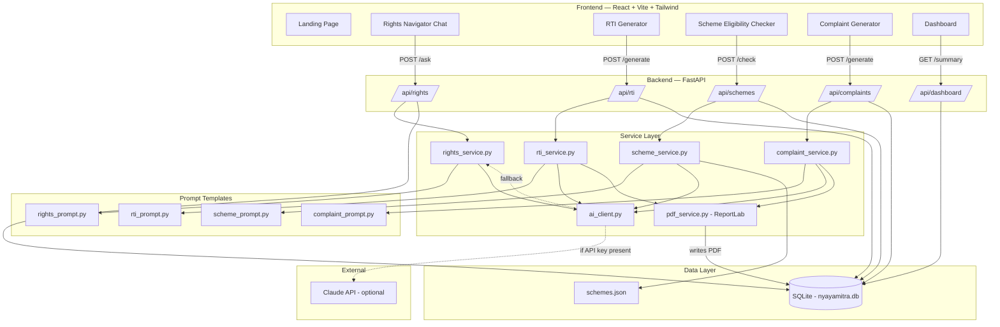
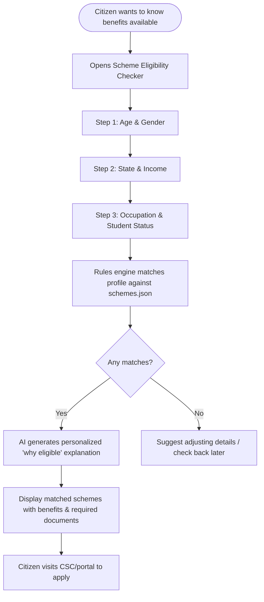

# NyayaMitra AI — Diagrams

## 1. System Architecture

```mermaid
flowchart TB
    subgraph Client["Frontend — React + Vite + Tailwind"]
        A1[Landing Page]
        A2[Rights Navigator Chat]
        A3[RTI Generator]
        A4[Scheme Eligibility Checker]
        A5[Complaint Generator]
        A6[Dashboard]
    end

    subgraph API["Backend — FastAPI"]
        B1[/api/rights/]
        B2[/api/rti/]
        B3[/api/schemes/]
        B4[/api/complaints/]
        B5[/api/dashboard/]
    end

    subgraph Services["Service Layer"]
        S1[rights_service.py]
        S2[rti_service.py]
        S3[scheme_service.py]
        S4[complaint_service.py]
        S5[pdf_service.py - ReportLab]
        S6[ai_client.py]
    end

    subgraph Prompts["Prompt Templates"]
        P1[rights_prompt.py]
        P2[rti_prompt.py]
        P3[scheme_prompt.py]
        P4[complaint_prompt.py]
    end

    subgraph Data["Data Layer"]
        D1[(SQLite - nyayamitra.db)]
        D2[schemes.json]
    end

    subgraph External["External"]
        E1[Claude API - optional]
    end

    A2 -->|POST /ask| B1
    A3 -->|POST /generate| B2
    A4 -->|POST /check| B3
    A5 -->|POST /generate| B4
    A6 -->|GET /summary| B5

    B1 --> S1
    B2 --> S2
    B3 --> S3
    B4 --> S4
    B5 --> D1

    S1 --> P1
    S2 --> P2
    S3 --> P3
    S4 --> P4

    S1 --> S6
    S2 --> S6
    S3 --> S6
    S4 --> S6
    S6 -.->|if API key present| E1
    S6 -.->|fallback| S1

    S2 --> S5
    S4 --> S5
    S5 -->|writes PDF| D1

    S3 --> D2
    B1 --> D1
    B2 --> D1
    B3 --> D1
    B4 --> D1
```

## 2. User Flow — RTI Generation Journey

```mermaid
flowchart LR
    Start([Citizen has a grievance]) --> Land[Visits NyayaMitra AI Landing Page]
    Land --> Choice{What do they need?}

    Choice -->|Understand rights first| Chat[Rights Navigator Chat]
    Chat --> Guidance[Gets rights, authority, documents, next steps]
    Guidance --> Decide{Ready to act?}

    Choice -->|Knows they need RTI| RTIForm[RTI Generator — Step 1: Issue Details]
    Decide -->|Yes, file RTI| RTIForm

    RTIForm --> RTIForm2[Step 2: Applicant Details]
    RTIForm2 --> RTIForm3[Step 3: Review]
    RTIForm3 --> Generate[AI drafts RTI content]
    Generate --> PDF[ReportLab generates formatted PDF]
    PDF --> Download[Citizen downloads PDF]
    Download --> Dashboard[Document appears in Dashboard]
    Dashboard --> File[Citizen files RTI with department]

    Decide -->|No, check schemes| Schemes[Scheme Eligibility Checker]
    Decide -->|No, file complaint| Complaint[Complaint Letter Generator]
```

## 3. User Flow — Scheme Eligibility Journey

```mermaid
flowchart TD
    A([Citizen wants to know benefits available]) --> B[Opens Scheme Eligibility Checker]
    B --> C[Step 1: Age & Gender]
    C --> D[Step 2: State & Income]
    D --> E[Step 3: Occupation & Student Status]
    E --> F[Rules engine matches profile against schemes.json]
    F --> G{Any matches?}
    G -->|Yes| H[AI generates personalized 'why eligible' explanation]
    H --> I[Display matched schemes with benefits & required documents]
    I --> J[Citizen visits CSC/portal to apply]
    G -->|No| K[Suggest adjusting details / check back later]
```
